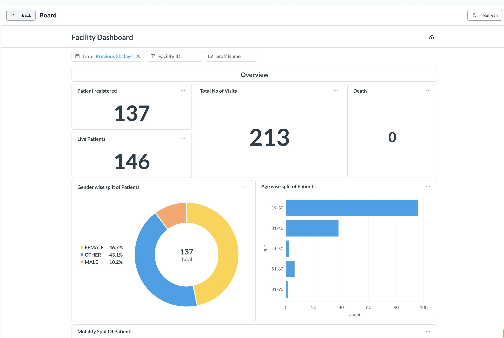

# Care Analytics FE Plugin

CARE Analytics FE is a frontend plugin for CARE based on micro frontend architecture for analytics workflows. This plugin adds UI components for:

- Viewing analytics dashboards in CARE
- Listing and searching analytics dashboards at facility and organization level
- Creating, editing, and archiving analytics configurations from Admin
- Opening handler-generated dashboard URLs inside CARE with refresh support

## Getting Started

### Prerequisites

- Node.js and npm (refer `care_fe` repository for the exact version requirements)
- Metabase is required for dashboards to be displayed in CARE

### Setup Instructions

1. First you will need to setup both Care [backend](https://github.com/ohcnetwork/care) and [frontend](https://github.com/ohcnetwork/care_fe) first before starting the `care_analytics_fe` development server

2. Clone the CARE Analytics FE repository:
  
```bash
git clone git@github.com:ohcnetwork/care_analytics_fe.git
```

3. Install dependencies for CARE Analytics FE:

```bash
cd care_analytics_fe
npm install
```

4. Start the development server:

```bash
npm run start 
```

## Registering the Plugin in CARE

After running the plugin locally (or deploying it), register it in your CARE
instance

## Create Analytics Config

Once the plugin is connected, configure dashboards from:

- **Admin > Analytics Config**
- Click **Create Analytics Config**

### Fields Explained

- `Name`: Display name shown to users in Analytics cards does not need to be the same as the Metabase dashboard name
- `Description`: Short explanation shown under the card title
- `Handler`: Metabase name. Use `metabase`
- `Handler Arguments`: JSON with the Metabase dashboard ID:

```json
{
  "dashboard_id": 9
}
```

- `Context Type`: Scope where this config appears (`facility` or `organization`)
- `Context Mapping`: JSON object for applying dashboard filters from CARE context, so users in a facility only see that facility's data:

```json
{
  "facility_id": "{{{facility_id_external_id}}}"
}
```

- `Metadata`: Optional JSON object for additional analytics config metadata

## Where the Dashboard Appears in CARE

After saving an active config:

1. Go to a facility in `care_fe`.
2. Open **Analytics** from the facility navbar.
3. You will see dashboard cards (Name + Description).
4. Click **View Dashboard** to open the embedded Metabase dashboard.
5. Use **Refresh** inside the viewer to regenerate and reload the analytics URL.
Example :


## How the Flow Works

1. Admin creates an analytics config (`/api/analytics/config/`).
2. Facility/organization Analytics page lists matching configs.
3. On dashboard open, plugin calls generate URL API:
   `/api/analytics/config/{analyticsConfigId}/generate_analytics_url/`
4. CARE renders the returned `redirect_url` in an embedded viewer.

A demo deployment is available at [https://care-analytics-fe.pages.dev/](https://care-analytics-fe.pages.dev/)
